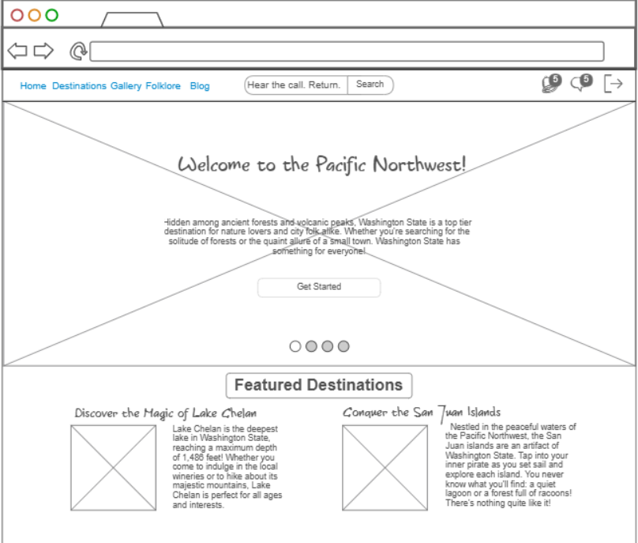
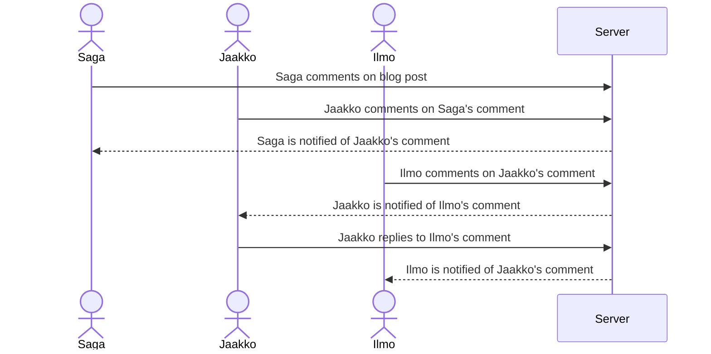

# Travel Guide Analog Horror

## Specification Deliverable
### Elevator Pitch
Travel websites are like cookie cutters of one another. While this website will superficially fit into this mold, there is more to it than is initially seen. As you explore the pages and vicariously capture the spirit of Washington State, you'll gradually uncover the secrets of a mysterious lake that the travel blogger is drawn to. With interactive maps, interesting blog posts, and local tales of the supernatural, this immersive experience will have you questioning reality as you dive beneath the surface.

### Design

### Sequence Diagram
Here is a sequence diagram to show how users might interact with the website especially considering comments:

### Key Features
- Interactive Map
- Destination Information
- Blogger Journal
- Photo and video gallery
- Local Folklore
- Real-time updates
- User comments and discussions on each section (with admin control)
- Newsletter Sign-up
- Analog Horror Integration (includes popups, changes in style, photo gallery lightbox, progressive change as user continues to interact with the website)

### Technologies
- **HTML** - used to create the basic structure of the website and each of its various sections including home, destinations, folklore, and blog.
- **CSS** - Styles the website to have a normal initial design, but will change as the user interacts with the page, introducing eerie elements to the UI.
- **JavaScript** - handles various elements like the interactive map, maps user clicks so that the style can change.
- **React** - for login, display user and blogger comments/posts, and simple user profiles
- **Web Service** - displaying and retrieving the following:
    - login
    - user interactions
    - blog posts
    - destination information
    - gallery media
    - local folklore 
    - external API to display weather updates for destinations 
- **Authentication** - user accounts to participate in user interactions
- **Database Data** - Content, including user added comments will be kept in perpetuity.
- **WebSocket** - real time updates for user interactions, weather information, and blog posts.

### HTML Deliverable
With this html deliverable, I added the basic structure of my website with home, destinations, gallery, folklore, blog, and login pages. I added content(images, destinations, folklore, and a filler blog post) to each of these pages and tried to implement as much as I could to the best of my ability. As I implement CSS and other technologies I expect for this structure to shift as I further flesh out the website.

#### Placeholders Placed
- **Index.html**:
    - logged in placeholder
    - single picture representing a carousel
- **Destinations.html**:
    - 3rd party calls for local weather information
- **Folklore.html**:
    - N/A
- **Gallery.html**:
    - add expand image on click and implement more effects for images
- **Blog.html**:
    - Button placeholders for liking and commenting on blogs
    - Websocket communication will take place as comments are liked and comments reply to comments
- **Login.html**:
    - Login basic structure

### CSS Deliverable
With this css deliverable, I added several stylized elements including background, font change, and animation effects. I attempted to properly stylize each element (header, footer, main content, navigation, application elements, and application images and text) so that it would fit the aesthetic.
#### Aspects Changed
- **All htmls**:
    - background color implementation
    - font-family implementation
    - button stylization
    - dynamic resizing
    - hyperlink stylization
    - footer added and stylized
    - Spacing issues resolved
    - Bootstrap implementation
- **Index.html**:
    - Text-image overlay
- **Destinations.html**:
    - glitch animation for relevant words
- **Folklore.html**:
    - glitch animation for relevant words
- **Gallery.html**:
    - pop-out animation on hover
    - image size and border standardization
- **Blog.html**:
    - Button stylization
- **Login.html**:
    - button stylization

### React Deliverable
With this React deliverable, I converted all the html documents to JSX and made login and comments mimic functionality.
There was a complete overhaul on the application structure. The application was bundled using Vite. React was fully implemented. I made it use a React router to access the different pages. Custom React Hooks to add the semi-functionality to comments and some random cryptic messages to the gallery. I would add more effects, but I currently lack the knowledge and time to do so.

### Service Deliverable
With this Service deliverable,  I created an HTTP service using Node.js and Express, my frontend is served up using Express static middleware (comments on blogs), my frontend calls third party service endpoints (see weather information in Destinations), my backend provides service endpoints, my frontend calls your service endpoints using fetch (see comments on blogs).