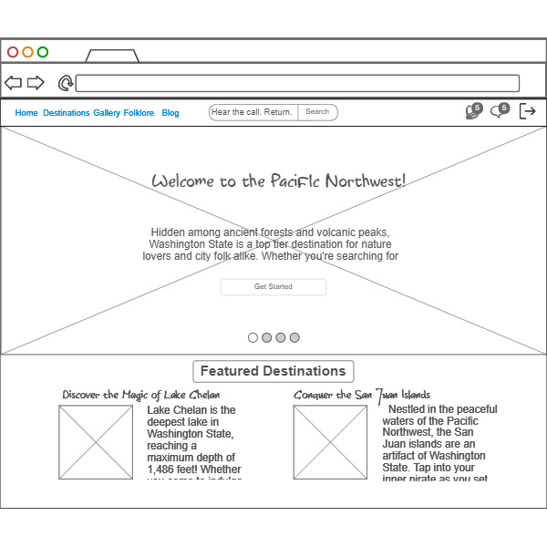

# Travel Guide Analog Horror

## Specification Deliverable
### Elevator Pitch
Travel websites are like cookie cutters of one another. While this website will superficially fit into this mold, there is more to it than is initially seen. As you explore the pages and vicariously capture the spirit of Washington State, you'll gradually uncover the secrets of a mysterious lake that the travel blogger is drawn to. With interactive maps, interesting blog posts, and local tales of the supernatural, this immersive experience will have you questioning reality as you dive beneath the surface.

### Design
THIS IMAGE SUCKS REPLACE

### Sequence Diagram
TODO::

### Key Features
- Interactive Map
- Destination Information
- Blogger Journal
- Photo and video gallery
- Local Folklore
- real-time updates
- User comments and discussions on each section (with admin control)
- Newsletter Sign-up
- Analog Horror Integration (includes popups, changes in style, photo gallery lightbox, progressive change as user continues to interact with the website)

### Technologies
- **HTML** - used to create the basic structure of the website and each of its various sections including home, destinations, folklore, and blog.
- **CSS** - Styles the website to have a normal initial design, but will change as the user interacts with the page, introducing eerie elements to the UI.
- **JavaScript** - handles various elements like the interactive map, maps user clicks so that the style can change.
- **React** - for login, display user and blogger comments/posts, and simple user profiles
- **Web Service** - displaying and retrieving the following:
    - login
    - user interactions
    - blog posts
    - destination information
    - gallery media
    - local folklore 
    - external API to display weather updates for destinations 
- **Authentication** - user accounts to participate in user interactions
- **Database Data** - Content, including user added comments will be kept in perpetuity.
- **WebSocket** - real time updates for user interactions, weather information, and blog posts.